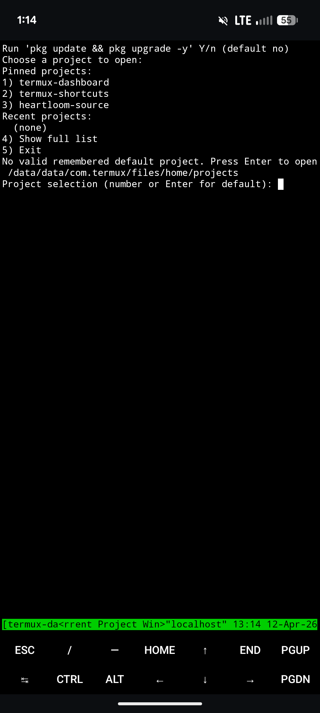
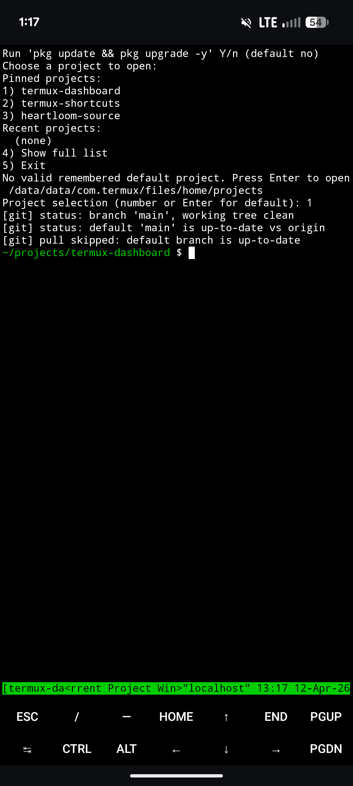

# Termux Dashboard

_One-tap project entry for Termux and tmux._

`termux-dashboard` is a tmux-based mobile developer workspace launcher for Termux.

Core promise: Open the right repo, in the right tmux workspace, with git-aware mobile re-entry in Termux.

Status: usable alpha. Stable enough for real workflows.



## Why it exists

Using Termux seriously on Android is powerful, but getting back into the right repo and tmux state is slower and messier than it should be.

`termux-dashboard` gives you a consistent, git-aware, tmux-based project entry flow from a shortcut.

## Who it is for

- Developers who already use Termux seriously.
- tmux users who want fast mobile re-entry.
- Firmware, embedded, infra, and shell-heavy engineers.
- Developers working in short mobile sessions.
- People who prefer local-first tools and simple shell scripts.

## What it does

- Starts from the `termux-dashboard` shortcut entry point.
- Creates or reattaches a tmux session with a fixed 4-window flow.
- Opens project and script menus with pinned/recent-first selection.
- Uses git-aware pull gating (prompt only when default branch is behind remote).
- Keeps repo/runtime behavior source-of-truth in this repository.

## Repo scope

This repository is the source-of-truth for dashboard behavior, tests, and docs.

- Open-source core: local-first shell workflow with clear behavior/docs.
- Business-compatible posture: paid support/customization can be layered later without changing repo scope.
- Downstream installer/integration work belongs in `termux-shortcuts`.

## Repo layout

- `scripts/termux-dashboard` — dashboard launcher and window flows.
- `tests/lint-shell.sh` — shell syntax + shellcheck lint path.
- `tests/termux-dashboard-smoke.sh` — tmux behavior smoke tests.
- `docs/termux-dashboard.md` — dashboard behavior spec.
- `docs/DECISIONS.md` — dashboard-only architecture/behavior decisions.
- `docs/INDEX.md` — docs entrypoint for this repo.

## Screenshots and demo



Demo clip: [Widget to repo flow (MP4)](docs/assets/termux-dashboard-demo-widget-to-repo.mp4)

## Local testing

```sh
bash tests/lint-shell.sh
bash tests/termux-dashboard-smoke.sh
```

## Downstream integration note

`termux-shortcuts` owns installer/integration concerns. This repo stays focused on `termux-dashboard` runtime behavior and validation.

## Support

If this is useful and you want to support continued work, GitHub Sponsors helps. I’m also interested in paid setup/customization/support for real workflows.
